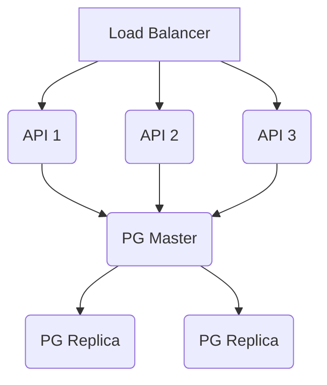

# RAG Data Platform

Plataforma de RAG (Retrieval Augmented Generation) containerizada com Docker Compose. Arquitetura completa: ingestão, indexação vetorial (PostgreSQL + pgvector), busca semântica e geração de respostas com LLMs via API (Groq/Gemini).

## 📋 Índice

- [Arquitetura](#arquitetura)
- [O que é RAG?](#o-que-é-rag)
- [O que são Embeddings?](#o-que-são-embeddings)
- [Stack Tecnológica](#stack-tecnológica)
- [Estrutura do Projeto](#estrutura-do-projeto)
- [Como Executar](#como-executar)
- [Testando a API](#testando-a-api)
- [Exemplos de Uso](#exemplos-de-uso)
- [Interfaces Web](#interfaces-web)
- [Escalabilidade](#escalabilidade)
- [Configurações Avançadas](#configurações-avançadas)
- [Troubleshooting](#troubleshooting)
- [Licença e Contribuições](#licença-e-contribuições)
- [Contato](#contato)

## 🏗️ Arquitetura

Este projeto demonstra uma arquitetura completa de ingestão, indexação vetorial, busca semântica e geração de respostas usando LLMs via API (Groq/Gemini).

### Fluxo de Dados

1.  **Upload** → MinIO (armazenamento)
2.  **Extração** → Texto do documento
3.  **Embedding** → Vector (768 dim)
4.  **Indexação** → PostgreSQL + pgvector
5.  **Busca** → Similaridade vetorial
6.  **RAG** → Contexto + LLM → Resposta

### Componentes

-   **FastAPI**: API REST para upload, busca e RAG
-   **PostgreSQL + pgvector**: Banco de dados vetorial para busca semântica
-   **MinIO**: Armazenamento de objetos (S3-compatible) para documentos
-   **Serviço de Ingestão**: Monitora diretório e processa arquivos automaticamente
-   **Embeddings Service**: Gera embeddings via Google Gemini Embeddings API

Para uma representação visual da arquitetura, consulte o diagrama: [doc/rag-plataform-diagram.png](rag-data-platform/doc/rag-plataform-diagram.png)

## 🤖 O que é RAG?

**RAG (Retrieval Augmented Generation)** é uma técnica que combina busca de informações com geração de texto usando LLMs.

### Como Funciona:

1.  **Retrieval (Busca)**: Quando o usuário faz uma pergunta, o sistema busca documentos relevantes usando busca semântica (similaridade de embeddings)
2.  **Augmentation (Aumento)**: Os documentos encontrados são usados como contexto
3.  **Generation (Geração)**: O LLM recebe a pergunta + contexto e gera uma resposta baseada nas informações encontradas

### Vantagens:

-   ✅ Respostas baseadas em documentos específicos (não apenas conhecimento do modelo)
-   ✅ Reduz alucinações (o modelo tem contexto real)
-   ✅ Permite atualizar conhecimento sem retreinar o modelo
-   ✅ Rastreabilidade (sabe de onde veio a informação)

## 🔢 O que são Embeddings?

**Embeddings** são representações numéricas (vetores) de texto que capturam significado semântico.

### Características:

-   Textos similares em significado têm embeddings próximos no espaço vetorial
-   Permitem busca por significado, não apenas palavras-chave
-   Dimensão típica: 384, 768, 1536 (dependendo do modelo)

### Exemplo:

```
"O que é machine learning?" → [0.23, -0.45, 0.67, ...] (384 números)
"O que é aprendizado de máquina?" → [0.25, -0.43, 0.65, ...] (muito similar!)
"Qual é a receita do bolo?" → [0.12, 0.89, -0.34, ...] (muito diferente!)
```

### Busca Vetorial:

Usando **similaridade de cosseno**, encontramos documentos com embeddings mais próximos à query:

```
similaridade = cos(θ) = (A · B) / (||A|| × ||B||)
```

## 🛠️ Stack Tecnológica

| Componente     | Tecnologia          | Versão      | Propósito                           |
| :------------- | :------------------ | :---------- | :---------------------------------- |
| API            | FastAPI             | 0.104+      | API REST assíncrona                 |
| Banco          | PostgreSQL          | 16          | Banco relacional                    |
| Vetores        | pgvector            | latest      | Extensão para busca vetorial        |
| Storage        | MinIO               | latest      | Armazenamento S3-compatible         |
| LLM            | Groq / Gemini       | API externa | Geração de respostas via provedores |
| Embeddings     | Gemini Embeddings API | google-genai | Modelo gemini-embedding-001         |
| Ingestão       | Python + watchdog   | 3.11        | Monitoramento de arquivos           |

## 📁 Estrutura do Projeto

```
./
├── api/                    # API FastAPI (upload, busca, RAG)
│   ├── main.py
│   ├── database.py
│   ├── minio_client.py
│   ├── embeddings_service.py
│   ├── rag_service.py
│   ├── document_service.py
│   ├── static/             # UI minimalista
│   ├── requirements.txt
│   └── Dockerfile
│
├── ingestion/              # Serviço de ingestão (watch de diretório)
│   ├── ingestion_service.py
│   ├── requirements.txt
│   └── Dockerfile
│
├── docker/
│   └── postgres/
│       └── init.sql        # Script de inicialização do banco
│
├── data/                   # Diretório monitorado para novos documentos
│   └── .gitkeep
│
├── scripts/                # Scripts auxiliares
│   ├── criar_link_docker.ps1
│   ├── fix_docker_wsl.ps1
│   ├── reinstalar_docker.ps1
│   ├── restaurar_docker.ps1
│   ├── setup_ollama.sh*    # Script legado (não utilizado no fluxo atual)
│   ├── subir_e_validar.ps1
│   └── test_api.sh*
│
├── docs/                   # Documentação adicional
│   ├── AUDITORIA_FRONTEND.md
│   ├── ESCALABILIDADE_E_PRODUCAO.md
│   ├── OAUTH_REDIRECT_URI.md
│   └── PLANO_COMPLETO_FRONTEND_E_RAG.md
│
├── embeddings/             # Módulo de embeddings (referência)
│   └── __init__.py
│
├── rag-data-platform/      # Código-fonte original (referência)
│                           # (Detalhes da estrutura interna em rag-data-platform/README.md)
│
├── docker-compose.yml
├── .env.example
├── README.md               # Este arquivo
└── requirements.txt        # Dependências principais do projeto
```

## 🚀 Como Executar

### Pré-requisitos

-   Docker Desktop (ou Docker + Docker Compose)
-   Portas disponíveis: 8000, 5432, 9000, 9001

### Passo 1: Configurar variáveis de ambiente (opcional)

```bash
cp .env.example .env
# Edite .env se precisar alterar credenciais (padrões já funcionam)
```

### Passo 2: Iniciar os Serviços

Na **raiz do projeto**:

```bash
docker compose up -d
```

Este comando irá:
-   ✅ Baixar todas as imagens necessárias
-   ✅ Criar volumes persistentes
-   ✅ Inicializar PostgreSQL com pgvector
-   ✅ Configurar MinIO
-   ✅ Subir API FastAPI
-   ✅ Iniciar serviço de ingestão

### Passo 3: Aguardar Inicialização

Aguarde alguns minutos para:
-   PostgreSQL inicializar
-   API carregar o modelo de embeddings

### Passo 4: Verificar Saúde dos Serviços

```bash
# Health check da API
curl http://localhost:8000/health

# Verificar logs
docker compose logs -f api
```

## 🧪 Testando a API

### 1. Health Check

```bash
curl http://localhost:8000/health
```

**Resposta esperada:**

```json
{
  "status": "ok",
  "database": "healthy",
  "services": {
    "embeddings": "ready",
    "rag": "ready"
  }
}
```

### 2. Upload de Documento

```bash
# Criar arquivo de teste
echo "Machine Learning é uma área da inteligência artificial que permite aos computadores aprenderem com dados sem serem explicitamente programados. Existem três tipos principais: aprendizado supervisionado, não supervisionado e por reforço." > documento.txt

# Upload
curl -X POST "http://localhost:8000/upload" \
  -F "file=@documento.txt"
```

**Resposta esperada:**

```json
{
  "message": "Documento processado com sucesso",
  "document_id": 1,
  "filename": "documento.txt",
  "file_path": "uuid-xxxxx.txt",
  "content_length": 245
}
```

### 3. Busca Semântica

```bash
curl -X POST "http://localhost:8000/search" \
  -H "Content-Type: application/json" \
  -d '{
    "query": "O que é aprendizado de máquina?",
    "limit": 5,
    "threshold": 0.7
  }'
```

**Resposta esperada:**

```json
[
  {
    "id": 1,
    "filename": "documento.txt",
    "content": "Machine Learning é uma área...",
    "similarity": 0.92,
    "metadata": {
      "file_size": 245,
      "file_type": ".txt"
    }
  }
]
```

### 4. RAG (Pergunta com Resposta Gerada)

```bash
curl -X POST "http://localhost:8000/rag" \
  -H "Content-Type: application/json" \
  -d '{
    "query": "Quais são os tipos de machine learning?",
    "limit": 3,
    "temperature": 0.7
  }'
```

**Resposta esperada:**

```json
{
  "answer": "Baseado no contexto fornecido, existem três tipos principais de machine learning: aprendizado supervisionado, não supervisionado e por reforço...",
  "sources": [
    {
      "id": 1,
      "filename": "documento.txt",
      "content": "Machine Learning é uma área...",
      "similarity": 0.95
    }
  ],
  "query": "Quais são os tipos de machine learning?"
}
```

### 5. Listar Documentos

```bash
curl http://localhost:8000/documents
```

## 📚 Exemplos de Uso

### Exemplo Completo: Pipeline RAG

```bash
# 1. Criar múltiplos documentos
cat > doc1.txt << EOF
Python é uma linguagem de programação de alto nível, interpretada e de propósito geral.
Foi criada por Guido van Rossum e lançada em 1991.
Python é conhecida por sua sintaxe simples e legibilidade.
EOF

cat > doc2.txt << EOF
FastAPI é um framework web moderno e rápido para Python.
É baseado em type hints e suporta async/await nativamente.
FastAPI é uma das frameworks mais rápidas disponíveis.
EOF

# 2. Upload dos documentos
curl -X POST "http://localhost:8000/upload" -F "file=@doc1.txt"
curl -X POST "http://localhost:8000/upload" -F "file=@doc2.txt"

# 3. Buscar informações sobre Python
curl -X POST "http://localhost:8000/search" \
  -H "Content-Type: application/json" \
  -d '{"query": "Quem criou Python?", "limit": 3}'

# 4. Fazer pergunta usando RAG
curl -X POST "http://localhost:8000/rag" \
  -H "Content-Type: application/json" \
  -d '{
    "query": "Me explique o que é FastAPI e suas características principais",
    "limit": 2
  }'
```

### Usando o Serviço de Ingestão

O serviço de ingestão monitora o diretório `/data` (mapeado para `./data` localmente):

```bash
# Copiar arquivo para o diretório monitorado
cp documento.txt ./data/

# O serviço detectará automaticamente e processará o arquivo
# Ver logs:
docker compose logs -f ingestion
```

## Interfaces Web

-   **API Swagger**: http://localhost:8000/docs
-   **MinIO Console**: http://localhost:9001 (usuário: minioadmin, senha: minioadmin)

## 📈 Escalabilidade

### Horizontal Scaling

#### 1. API FastAPI

```yaml
# docker-compose.yml
api:
  deploy:
    replicas: 3
  # Adicionar load balancer (nginx/traefik)
```

#### 2. PostgreSQL

-   **Read Replicas**: Para distribuir leituras
-   **Connection Pooling**: PgBouncer ou pgpool
-   **Sharding**: Particionar por tenant/categoria

#### 3. MinIO

-   **Distributed Mode**: Múltiplos nós para alta disponibilidade
-   **CDN**: CloudFront/Cloudflare para distribuição

#### 4. Provedor de LLM (Groq/Gemini)

-   **Failover por provedor**: Definir estratégia de fallback entre Groq e Gemini
-   **Controle de custos**: Ajustar modelo/temperatura por tipo de requisição
-   **Rate limit por chave**: Monitorar cotas e limites de API

### Otimizações

#### 1. Embeddings

```python
# Usar modelos mais eficientes
# - gemini-embedding-001 (768 dim) - atual
# - text-embedding-004 (768 dim) - alternativa
# - modelos locais com 1024+ dim (avaliar custo x qualidade)
```

#### 2. Busca Vetorial

```sql
-- Ajustar parâmetros HNSW
CREATE INDEX documents_embedding_idx ON documents
USING hnsw (embedding vector_cosine_ops)
WITH (m = 16, ef_construction = 64);
```

#### 3. Cache

-   **Redis**: Cache de embeddings e respostas RAG
-   **CDN**: Para documentos estáticos

#### 4. Processamento Assíncrono

-   **Celery/RQ**: Processar embeddings em background
-   **Kafka/RabbitMQ**: Fila de ingestão

### Arquitetura Escalada



## 🔧 Configurações Avançadas

### Variáveis de Ambiente

Crie um arquivo `.env` na raiz:

```env
# PostgreSQL
POSTGRES_USER=raguser
POSTGRES_PASSWORD=ragpass
POSTGRES_DB=ragdb

# MinIO
MINIO_ROOT_USER=minioadmin
MINIO_ROOT_PASSWORD=minioadmin
MINIO_BUCKET=documents

# LLM Providers
GROQ_API_KEY=
GOOGLE_API_KEY=

# Embeddings
GEMINI_API_KEY=
EMBEDDINGS_MODEL=gemini-embedding-001
EMBEDDING_DIM_FALLBACK=768
```

## 🐛 Troubleshooting

### Problema: Mudança de dimensão dos embeddings (1024 -> 768)

Ao migrar para `gemini-embedding-001`, recrie a collection no Qdrant se ela foi criada com 1024 dimensões.

```bash
docker compose stop fastapi
curl -X DELETE http://localhost:6333/collections/documents
docker compose up -d fastapi
```

### Problema: Erro de provedor LLM (Groq/Gemini)

```bash
# Ver logs da API para detalhes do erro de integração
docker compose logs -f api
```

Verifique se:
- `GROQ_API_KEY` e/ou `GOOGLE_API_KEY` estão definidos no ambiente
- a API externa está acessível na rede atual
- limites de uso/cota da chave não foram excedidos

### Problema: Erro de conexão com PostgreSQL

```bash
# Verificar se o banco está rodando
docker compose ps postgres

# Ver logs
docker compose logs postgres

# Conectar manualmente
docker exec -it rag-postgres psql -U raguser -d ragdb
```

### Problema: MinIO não acessível

```bash
# Verificar bucket
docker exec rag-minio mc ls minio/

# Criar bucket manualmente
docker exec rag-minio mc mb minio/documents
```

## 📝 Licença e Contribuições

Este projeto é um exemplo educacional. Sinta-se livre para usar e modificar.
Contribuições são bem-vindas! Sinta-se livre para abrir issues e pull requests.

## 📧 Contato

Para dúvidas ou sugestões, abra uma issue no repositório.

---

**Desenvolvido com ❤️ para demonstrar arquitetura RAG completa e containerizada**
