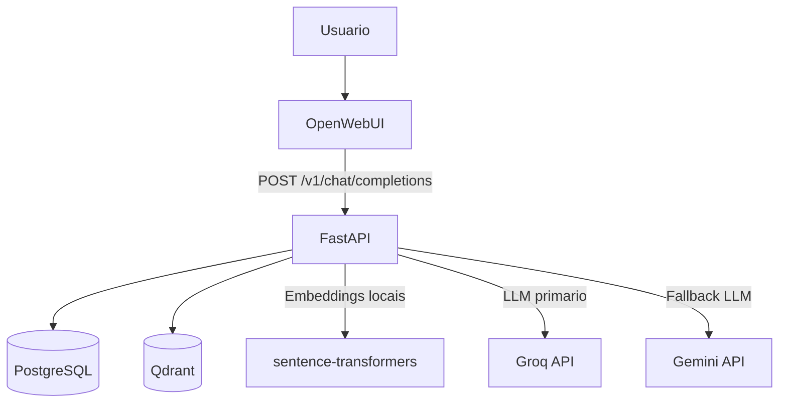
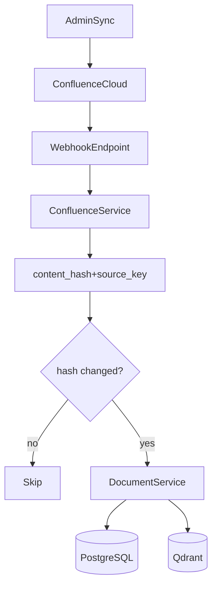

# RAG Data Platform

Plataforma de RAG containerizada com Docker Compose para suporte N2/N3. Este README descreve o estado real do runtime atual.

## 📋 Índice

- [TL;DR](#-tldr)
- [Quickstart (5 minutos)](#-quickstart-5-minutos)
- [Arquitetura Atual](#️-arquitetura-atual)
- [Tabela de Verdade (Ativo x Legado x Futuro)](#-tabela-de-verdade-ativo-x-legado-x-futuro)
- [Implantação Recomendada (Fases)](#️-implantação-recomendada-fases)
- [Estrutura do Projeto](#-estrutura-do-projeto-foco-operacional)
- [Endpoints Principais](#-endpoints-principais)
- [Variáveis de Ambiente Essenciais](#️-variáveis-de-ambiente-essenciais)
- [Ingestão Confluence (Incremental)](#-ingestão-confluence-incremental)
- [Troubleshooting Rápido](#-troubleshooting-rápido)
- [Documentação Complementar](#-documentação-complementar)
- [Licença e Contribuições](#-licença-e-contribuições)

## TL;DR

- API principal em `FastAPI`, banco relacional em `PostgreSQL` e banco vetorial em `Qdrant`.
- Embeddings são gerados localmente no container `fastapi` via `sentence-transformers` (modelo padrão `BAAI/bge-m3`).
- Respostas são geradas por cascata de LLM: `Groq` (prioridade) → `Gemini` (fallback, se `GOOGLE_API_KEY` ou `GEMINI_API_KEY` configurada).
- Frontend de chat: `Open WebUI` consumindo endpoint compatível OpenAI (`/v1/chat/completions`).
- Autenticação via Google OAuth com controle de domínio (`DOMAIN_ALLOWED`), papéis de admin e publicador.

## 🚀 Quickstart (5 minutos)

### Pré-requisitos

- Docker Desktop
- Portas livres: `3000`, `5432`, `6333`, `6334`, `8000`

### Subir ambiente

```bash
cp .env.example .env
# edite .env com suas chaves antes de subir
docker compose up -d
```

### Verificar saúde

```bash
curl http://localhost:8000/health
docker compose logs -f fastapi
```

### Acessos

- API docs: `http://localhost:8000/docs`
- Open WebUI: `http://localhost:3000`

## 🏗️ Arquitetura Atual



## 🧭 Tabela de Verdade (Ativo x Legado x Futuro)

| Componente | Estado | Implementação atual |
| :-- | :-- | :-- |
| API backend | Ativo | `fastapi` em `docker-compose.yml` |
| Banco relacional | Ativo | `postgres` (`pgvector/pgvector:pg16`) |
| Banco vetorial | Ativo | `qdrant` + `api/qdrant_service.py` |
| Embeddings | Ativo | `sentence-transformers` local (`api/embeddings_service.py`) |
| LLM | Ativo | Groq com fallback Gemini (`api/rag_service.py`) |
| Auth Google OAuth | Ativo | `api/auth.py` com controle de domínio e papéis |
| Open WebUI | Ativo | serviço `open-webui` no compose |
| Confluence incremental | Ativo | webhook + sync admin + scripts de ingestão na raiz |
| MinIO | Legado neste runtime | mencionado em docs antigos, não sobe no compose raiz |
| Worker `ingestion` dedicado | Legado no compose raiz | código existe em `ingestion/`, mas não está no compose atual |
| Ollama fallback | Futuro/roadmap | detalhado em docs de escalabilidade |

## 🛠️ Stack Tecnológica (runtime atual)

| Camada | Tecnologia | Observação |
| :-- | :-- | :-- |
| API | FastAPI | Endpoints REST e compatibilidade OpenAI |
| Dados relacionais | PostgreSQL | Metadados, usuários, conversas |
| Vetorial | Qdrant | Busca semântica por similaridade |
| Embeddings | sentence-transformers | Modelo default `BAAI/bge-m3` |
| Geração | Groq + Gemini | Cascata com fallback |
| Auth | Google OAuth 2.0 | Controle por domínio e papéis (admin/publicador) |
| UI | Open WebUI | Consumindo `/v1/*` da API |

## 🧱 Implantação Recomendada (Fases)

Para reduzir risco operacional e evitar duplicidade de dados:

1. **Fase A — Dedupe local primeiro**
   - estabilizar `/admin/sync` e `/internal/sync` com idempotência por origem;
   - garantir que arquivo repetido com mesmo conteúdo seja `skip`.
2. **Fase B — Confluence incremental**
   - ativar webhook + sync incremental com watermark;
   - reprocessar somente conteúdo alterado.
3. **Fase C — Hardening**
   - lock por origem, retries idempotentes, auditoria e monitoramento.

## 📁 Estrutura do Projeto (foco operacional)

```text
./
├── api/                        # Backend FastAPI (main.py, services, auth)
├── docker/postgres/            # init.sql do banco
├── docs/                       # documentação técnica complementar
├── data/                       # arquivos de entrada e storage local
├── scripts/                    # scripts utilitários
├── embeddings/                 # artefatos de embeddings
├── static/                     # assets estáticos da API
├── ingestion/                  # worker de ingestão (legado no compose raiz)
├── confluence_ingestion.py     # ingestão manual Confluence (execução direta)
├── confluence_initial_sync.py  # sincronização inicial completa
├── confluence_webhook.py       # handler webhook standalone
├── docker-compose.yml          # stack atual de runtime
├── .env.example                # variáveis de referência
└── rag-data-platform/          # base de referência/legado
```

## 🔌 Endpoints Principais

### Health

```bash
curl http://localhost:8000/health
```

### Upload de documento

```bash
curl -X POST "http://localhost:8000/upload" \
  -H "Authorization: Bearer <token>" \
  -F "file=@documento.txt"
```

### Busca semântica

```bash
curl -X POST "http://localhost:8000/search" \
  -H "Content-Type: application/json" \
  -d '{"query":"o que e fastapi","limit":5,"threshold":0.3}'
```

### Resposta RAG

```bash
curl -X POST "http://localhost:8000/rag" \
  -H "Content-Type: application/json" \
  -d '{"query":"resuma este projeto","limit":3,"temperature":0.4}'
```

### Chat com histórico

```bash
curl -X POST "http://localhost:8000/chat" \
  -H "Content-Type: application/json" \
  -d '{"message":"Oi","conversation_id":null}'
```

### Compatibilidade OpenAI (Open WebUI)

```bash
curl -X POST "http://localhost:8000/v1/chat/completions" \
  -H "Content-Type: application/json" \
  -d '{"model":"llama-3.1-8b-instant","messages":[{"role":"user","content":"Oi"}],"stream":false}'
```

### Gestão de conversas

```bash
GET  /conversations          # listar conversas do usuário
GET  /conversations/{id}     # detalhe de conversa
POST /conversations          # criar conversa
PATCH /conversations/{id}    # renomear conversa
DELETE /conversations/{id}   # excluir conversa
```

### Documentos (admin)

```bash
GET    /documents              # listar documentos indexados
DELETE /documents/{id}         # remover documento e seus chunks
```

### Administração

```bash
GET   /admin/settings          # configurações do sistema
PATCH /admin/settings          # atualizar configurações
GET   /admin/users             # listar usuários
POST  /admin/sync              # sync filesystem manual
POST  /admin/confluence/sync   # sync Confluence manual
```

## ⚙️ Variáveis de Ambiente Essenciais

Use `.env` a partir de `.env.example`. Abaixo as variáveis consumidas no runtime atual:

```env
# PostgreSQL
POSTGRES_USER=raguser
POSTGRES_PASSWORD=ragpass
POSTGRES_DB=ragdb

# LLM — Cascata Groq → Gemini
GROQ_API_KEY=gsk_chave1,gsk_chave2   # múltiplas chaves separadas por vírgula
GOOGLE_API_KEY=                        # habilita fallback Gemini (ou use GEMINI_API_KEY)
GEMINI_API_KEY=
GROQ_MODEL=llama-3.1-8b-instant
GEMINI_MODEL=gemini-1.5-flash

# Embeddings locais (sentence-transformers)
EMBEDDINGS_MODEL=BAAI/bge-m3
EMBEDDING_DIM_FALLBACK=1024

# Chunking
CHUNK_SIZE=512
CHUNK_OVERLAP=50

# Qdrant
QDRANT_COLLECTION=documents

# Auth Google OAuth
GOOGLE_CLIENT_ID=
GOOGLE_CLIENT_SECRET=
SESSION_SECRET=change-me
APP_URL=http://localhost:8000
DOMAIN_ALLOWED=cd2.com.br              # domínio permitido para login
ADMIN_EMAILS=                          # e-mails com papel admin (separados por vírgula)
PUBLICADOR_EMAILS=                     # e-mails com papel publicador

# Acesso anônimo (somente desenvolvimento)
ALLOW_ANONYMOUS_CHAT=false

# Ingestão via API interna
INGEST_API_KEY=                        # chave para endpoint /internal/upload

# Open WebUI
WEBUI_SECRET_KEY=change-me
OPENAI_API_KEY=dummy                   # qualquer valor não vazio; a autenticação real é da API

# Confluence (opcional)
CONFLUENCE_URL=
CONFLUENCE_EMAIL=
CONFLUENCE_TOKEN=
CONFLUENCE_SPACES=
CONFLUENCE_WEBHOOK_SECRET=
CONFLUENCE_TIMEOUT_SECONDS=45
```

## 🔁 Ingestão Confluence (Incremental)

### Endpoints

- Webhook: `POST /internal/confluence/webhook`
- Sync manual (admin): `POST /admin/confluence/sync`

### Scripts de ingestão direta (fora do compose)

Para execução pontual sem depender do endpoint HTTP:

```bash
python confluence_ingestion.py          # ingestão incremental
python confluence_initial_sync.py       # sincronização inicial completa
```

### Modelo de idempotência e watermark

O runtime atual usa estado por origem para evitar reprocessamento desnecessário:

- `source_type` (`filesystem`, `confluence`)
- `source_key` (Confluence: `page_id`; filesystem: caminho relativo canônico)
- `content_hash` (`sha256` do conteúdo normalizado)
- `last_modified_at` (timestamp da origem)
- `last_ingested_at` (timestamp local após sucesso)
- `status` (`pending`, `processing`, `done`, `failed`)

Regras:
- hash igual → `skip`
- hash diferente → `replace` controlado de chunks/vetores da origem
- sync incremental usa watermark de `last_modified_at` com janela de segurança

> Segurança: trate `CONFLUENCE_TOKEN` como segredo crítico. Se vazar, revogue e gere novo token antes de usar.

### Fluxo resumido



### Configuração de webhook (Cloud)

1. Confluence → Settings → System → Webhooks
2. URL: `https://seu-dominio.com/internal/confluence/webhook`
3. Eventos: page created, updated, removed
4. Secret: mesmo valor de `CONFLUENCE_WEBHOOK_SECRET`

### Runbook rápido (Confluence)

```bash
# 1) Subir stack
docker compose up -d

# 2) Verificar saúde
curl http://localhost:8000/health

# 3) Rodar sync incremental inicial (24h)
curl -X POST "http://localhost:8000/admin/confluence/sync" \
  -H "Content-Type: application/json" \
  -d '{"since_minutes":1440}'

# 4) Ver logs
docker compose logs -f fastapi
```

## 🐛 Troubleshooting Rápido

### Embedding dimension mismatch no Qdrant

```bash
docker compose stop fastapi
curl -X DELETE http://localhost:6333/collections/documents
docker compose up -d fastapi
```

### Erro de provedor LLM

```bash
docker compose logs -f fastapi
```

Verifique se `GROQ_API_KEY` está correta. Para habilitar fallback Gemini, configure `GOOGLE_API_KEY` ou `GEMINI_API_KEY`.

### `redirect_uri_mismatch` no login Google

Confira as URIs autorizadas e o `APP_URL` em:

- `docs/OAUTH_REDIRECT_URI.md`

## 📚 Documentação Complementar

- OAuth e redirect URI: `docs/OAUTH_REDIRECT_URI.md`
- Personalização visual Open WebUI: `docs/PERSONALIZACAO_VISUAL_OPENWEBUI.md`
- Escalabilidade e produção (roadmap/futuro): `docs/ESCALABILIDADE_E_PRODUCAO.md`
- Referência histórica da base original: `rag-data-platform/README.md`

> Este `README.md` é o manual mestre do projeto. Use os demais docs apenas como aprofundamento temático.

## 📝 Licença e Contribuições

Este projeto é um exemplo educacional. Sinta-se livre para usar e modificar.
Contribuições são bem-vindas via issues e pull requests.

## 📧 Contato

Para dúvidas ou sugestões, abra uma issue no repositório.

---

**Desenvolvido por Marcos Eduardo**
